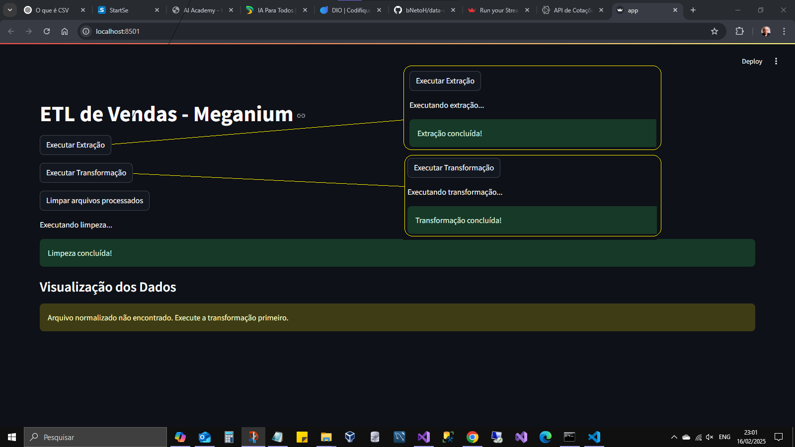

# Análise de Dados e Geração de Visualização de Dados

## Visão Geral

Este projeto demostra a utilização de chat com IA gpt4 versão gratuita para gerar scripts python que realizem os seguintes processos:

- ETL das amostras
- Obter cotação de moedas [awesomeapi.com.br](https://docs.awesomeapi.com.br/api-de-moedas)
- streamming da apresentação dos dados na web [streamlit](https://streamlit.io/)

## Amostras: Origem, Processo e Consumidores.

- Trata-se de dados fictícios de uma empresa fabricante de console de vídeo games, que terceiriza a distribuição e venda para outras plataformas.
- Seus produtos são vendidos globalmente.

## Objetivos da Atividade

- Usar o chatGPT da OpenAI para gerar scripts para implementar o projeto


## Objetivos do Projeto

- Consolidar todas as bases de terceiros em uma base comum para realizar a análise
- Normalizar dados para moeda comum (USD), integração com awesomeapi
- Transformar dados em informações relevantes para a fabricante
- Com a apresentação proporcionar insights para os tomadores de decisão

## Estrutura do Projeto


## Instalação

- Faça um fork do projeto para seu perfil

- Clone o projeto para o seu terminal

```
git clone https://github.com/{seu-perfil-github}/data-analysys
```

- Execute os comandos

```
cd data-analysys
python -m venv venv
venv\scripts\activate.bat
pip install -r requirements.txt
```

- Execute o projeto

```
streamlit run scripts\app.py
```

## Como o projeto funciona

- clique no botão 'Executar Extração' e será executado o script extraction.py: função ler todos os arquivos .csv em raw_data e salvar um arquivo resultado.csv em processed_data com todos os dados das amostras.
- clique no botão 'Executar Transformação' e será executado o script transformation.py: função ler os dados chamar a API para normalizar a base monetária das amostras, um novo arquivo com os dados normalizados será salvo em normalized_data.
- clique no botão 'Limpar arquivos processados' e será executado o script cleanup.py: função remover os arquivos resultados de processed_data e normalized_data.




## TODO:

- fix: Ajustar currency, taxa aplicada e timestamp para moedas dif.USD
- add: Adicionar botão para gerenciar amostras em raw_data
